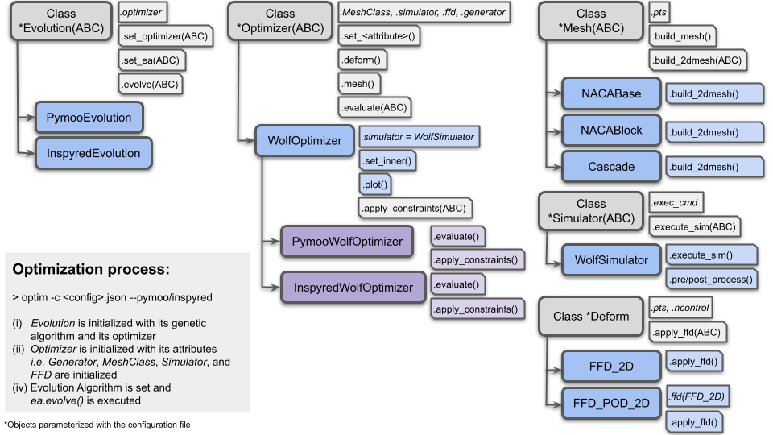

## AERO-Optim


**AERO-Optim** is a simple aerodynamic shape optimization framework coupling FreeForm Deformation (FFD), automatic meshing with [`gmsh`](https://gmsh.info/doc/texinfo/gmsh.html) and any CFD solver execution in the frame of an optimization algorithm based on [`inspyred`](https://inspyred.readthedocs.io/en/latest/) or [`pymoo`](https://pymoo.org/index.html). It is composed of the following core components:

* [`ffd.py`](aero_optim/ffd/ffd.py): which defines classes to perform FFD-based deformation of any 2D geometry,
* [`*mesh.py`](aero_optim/mesh/): which define multiples classes to generate automatic meshes,
* [`simulator.py`](aero_optim/simulator/simulator.py): which defines a class to orchestrate CFD simulations including pre- and post-processing steps as well as progress monitoring,
* [`*optimizer.py`](aero_optim/optim/) and [`evolution.py`](aero_optim/optim/): which define multiple classes to coordinate the optimization procedures with `inspyred` or `pymoo`.

The overall structure of the framework is illustrated on the Figure below:
<p float="left">
  
</p>

In an optimization, classes are created from left to right based on the execution command and the configuration file. All components can be inherited and customized to meet any need and the righmost classes can be loaded and tested separately.

The full documentation is available [**HERE**](https://mschouler.github.io/aero-optim/).

### Installation
**AERO-Optim** requires Python 3.10 or newer and comes with a few dependencies listed in [`requirements.txt`](./requirements.txt) and recalled below:
```sh
gmsh        # to design and visualize meshes (MESH)
inspyred    # optimization toolbox (OPTIM)
numpy       # to manipulate geometries as arrays (FFD)
matplotlib  # to visualize the generated deformed profiles (FFD)
pandas      # to load simulation results (OPTIM)
pymoo       # optimization toolbox (OPTIM)
scipy       # to use quasi monte carlo samplers (FFD)
```

From the user's working directory, they can all be installed at once in a [virtual environment](https://docs.python.org/3/library/venv.html) with the following commands:
```sh
git clone https://github.com/mschouler/aero-optim.git
cd aero-optim
python3 -m venv .venv
source .venv/bin/activate
pip install -r requirements.txt
pip install -e .
```

### To go further
Details about the following topics are available on the documentation:
* [First Execution](https://mschouler.github.io/aero-optim/#first-execution)
* [FFD Module](https://mschouler.github.io/aero-optim/ffd)
* [Mesh Module](https://mschouler.github.io/aero-optim/mesh)
* [Simulator Module](https://mschouler.github.io/aero-optim/simulator)
* [Optimizer Module](https://mschouler.github.io/aero-optim/optimizer)