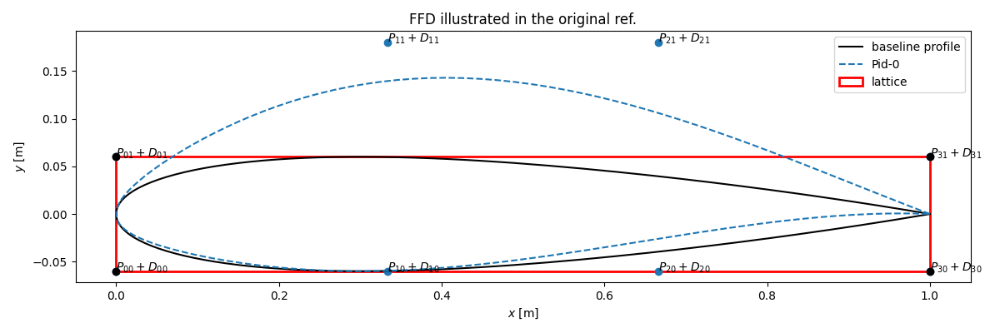
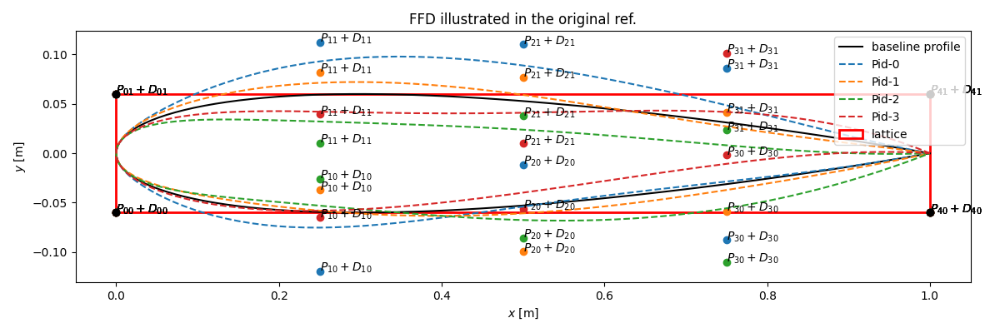

## Free-Form Deformation Module
Free-form Deformation (FFD) is a technique designed to deform solid geometric models in a free-form manner. It was originally introduced by Sederberg in 1986 ([doi](https://dl.acm.org/doi/10.1145/15886.15903)). The present implementation is based on the description in [Duvigneau 2006](https://inria.hal.science/inria-00085058/). 

The main steps of FFD are:

1) create a lattice, i.e. the minimal parallelepiped box that embeds the geometry (a rectangle in 2D),

2) project the geometry points into the lattice referential such that its coordinates now vary between [0;1] in both x and y directions,

3) for a given deformation vector applied to each control points of the lattice, the displacements of all points forming the geometry are computed with the tensor product of the Bernstein basis polynomials,

4) the deformed profile is finally projected back into the original referential.

!!! Note
    This implementation is limited to 2D geometries only. More sophisticated libraries exist such as [PyGeM](https://mathlab.github.io/PyGeM/index.html) or [pyGeo](https://mdolab-pygeo.readthedocs-hosted.com/en/latest/introduction.html) but they come with heavier dependencies and more cumbersome installation procedures.

### 2D FFD
Free-Form Deformation is implemented in `FFD_2D`, a straightforward class instantiated with two positional arguments:

- `file (str)` which indicates the filename of the baseline geometry to be deformed,
- `ncontrol (int)` which indicates the number of design points on each side of the lattice.

!!! Warning
    The input file is expected to have a specific formatting i.e. a 2 line header followed by coordinates given as tabulated entries (one point per row) with single space separators (see [`input/naca12.dat`](https://github.com/mschouler/aero-optim/blob/master/input/naca12.dat) for an example).

Once instantiated, the `apply_ffd(Delta)` method can be used to perform the deformation corresponding to the array `Delta`.

### Illustration
An FFD with 2 control points (i.e. 4 in total) and the deformation vector `Delta = (0., 0., 1., 1.)` will yield the following profile:
<p float="left">
  
</p>
Considering the figure notations, one notices that the deformation vector `Delta` corresponds to the list of deformations to be applied to the lower control points followed by those applied to the upper control points. In this case, `Delta` is: $$(D_{10}=0.,\, D_{20}=0.,\, D_{11}=1.,\, D_{21}=1.)$$ in lattice unit. The corner points are left unchanged so that the lattice corners remain fixed.

### Quick Experiments
The `auto_ffd.py` scripts enables basic testing and visualization. It comes with a few options:
```py
python3 auto_ffd.py --help
usage: auto_ffd.py [-h] [-f FILE] [-o OUTDIR] [-nc NCONTROL] [-np NPROFILE] [-r] [-s SAMPLER] [-d [DELTA ...]]

options:
  -h, --help            show this help message and exit
  -f FILE, --file FILE  baseline geometry: --datfile=/path/to/file.dat (default: None)
  -o OUTDIR, --outdir OUTDIR
                        output directory (default: output)
  -nc NCONTROL, --ncontrol NCONTROL
                        number of control points on each side of the lattice (default: 3)
  -np NPROFILE, --nprofile NPROFILE
                        number of profiles to generate (default: 3)
  -r, --referential     plot new profiles in the lattice ref. (default: False)
  -s SAMPLER, --sampler SAMPLER
                        sampling technique [lhs, halton, sobol] (default: lhs)
  -d DELTA, --delta DELTA
                        Delta: 'D10 D20 .. D2nc' (default: None)
```

Hence, the command below will perform 3 control points FFDs for 4 random deformations sampled with an LHS sampler:
```py
python3 auto_ffd.py -f input/naca12.dat -np 4 -nc 3 -s lhs
```
<p float="left">
  
</p>

!!! Note
    The positions of the deformed control points on the generated figure correspond to those of the last profile, in this case `Pid-3`.
