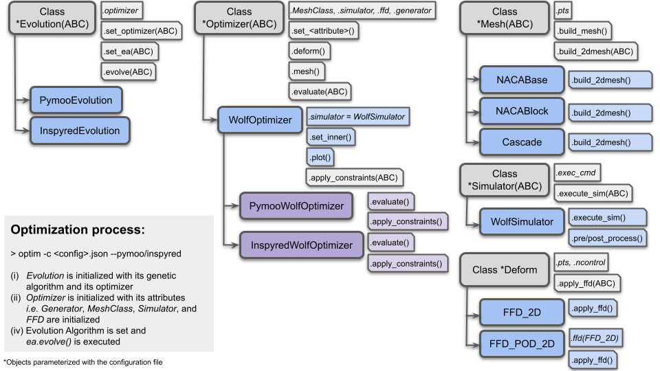
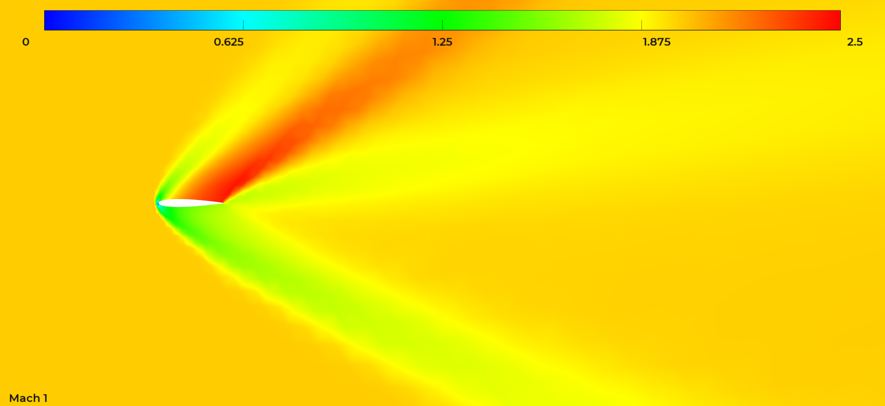
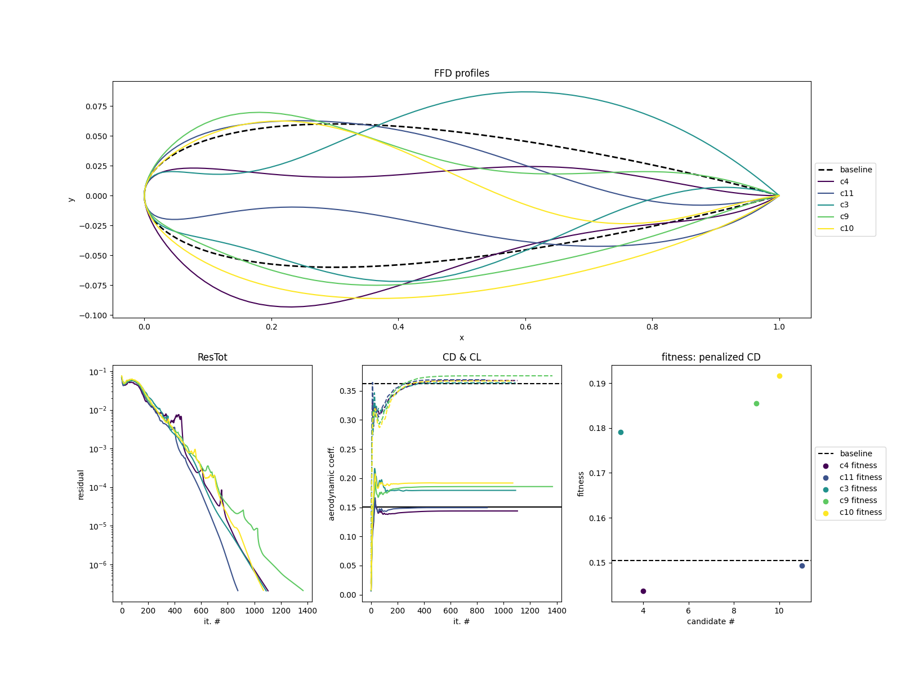

## Welcome to AERO-Optim
**AERO-Optim** is a simple aerodynamic shape optimization framework coupling FreeForm Deformation (FFD), automatic meshing with [`gmsh`](https://gmsh.info/doc/texinfo/gmsh.html) and any CFD solver execution in the frame of an optimization algorithm based on [`inspyred`](https://inspyred.readthedocs.io/en/latest/) or [`pymoo`](https://pymoo.org/index.html). It is composed of the following core components:

* [Deform](ffd.md): which defines classes to perform FFD-based deformation of any 2D geometry,
* [Mesh](mesh.md): which defines multiple classes to generate automatic meshes,
* [Simulator](simulator.md): which defines a class to orchestrate CFD simulations including pre- and post-processing steps as well as progress monitoring,
* [Optimizer](optimizer.md) and [Evolution](optimizer.md): which define multiple classes to coordinate the optimization procedures with `inspyred` or `pymoo`

The overall structure of the framework is illustrated on the Figure below:
<p float="left">
  
</p>

In an optimization, classes are created from left to right based on the execution command and the configuration file. All components can be inherited and customized to meet any need and the righmost classes can be loaded and tested separately.

### Quick Installation
**AERO-Optim** requires Python 3.10 or newer and comes with a few dependencies listed in [`requirements.txt`](https://github.com/mschouler/aero-optim/blob/master/requirements.txt) and recalled below:
```sh
gmsh        # to design and visualize meshes (MESH)
inspyred    # optimization toolbox (OPTIM)
numpy       # to manipulate geometries as arrays (FFD)
matplotlib  # to visualize the generated deformed profiles (FFD)
pandas      # to load simulation results (OPTIM)
pymoo       # optimization toolbox (OPTIM)
scipy       # to use quasi monte carlo samplers (FFD)
```

From the user's working directory, they can all be installed at once in a [virtual environment](https://docs.python.org/3/library/venv.html) with the following commands:
```sh
git clone https://github.com/mschouler/aero-optim.git
cd aero-optim
python3 -m venv .venv
source .venv/bin/activate
pip install -r requirements.txt
pip install -e .
```

!!! Warning
    The virtual environment must be sourced every time a new terminal is launched!

!!! Note
    So far, the framework was only installed and tested on MacOS and Linux platforms.

### First Execution
The framework was designed to automate aerodynamic optimization which, in this case, consists in:

1) deforming a baseline geometry,

2) generating its associated mesh,

3) performing a CFD computation,

as many times as required to obtain a geometry maximizing/minimizing certain quantities of interest (QoIs).

Although the chaining of these steps is performed under the supervision of [`main_optim.py`](https://github.com/mschouler/aero-optim/blob/master/aero_optim/main/main_optim.py), the three subscripts presented below were introduced to facilitate each step's individual evaluation:

#### First FFD: [`auto_ffd.py`](https://github.com/mschouler/aero-optim/blob/master/aero_optim/main/auto_ffd.py)
This script performs one or multiple FFD of the geometry passed as its input argument. For instance:
```sh
# from aero-optim to naca_base
cd examples/NACA12/naca_base
ffd -f ../data/naca12.dat -nc 2 -d "0. 0. 1. 1."
```
will yield the figure below:
<p float="left">
  
</p>
where the deformation vector is $$[D_{10}, D_{20}, D_{11}, D_{21}] = [0., 0., 1., 1.]$$ in lattice unit (see [FFD](ffd.md)).

#### First Mesh: [`auto_gmsh.py`](https://github.com/mschouler/aero-optim/blob/master/aero_optim/main/auto_gmsh.py)
This script generates a simple mesh parameterized according to its associated configuration file. For instance:
```sh
# from aero-optim to naca_base
cd examples/NACA12/naca_base
mesh --config=naca_base.json  # left figure
cd ../naca_block
mesh --config=naca_block.json # right figure
```
will generate the figures below:
<p float="left">
  
   
</p>

#### First Simulation: [`auto_simulator.py`](https://github.com/mschouler/aero-optim/blob/master/aero_optim/main/auto_simulator.py)
This script performs a single simulation according to its associated configuration file and mesh. For instance:
```sh
# from aero-optim to naca_base
cd examples/NACA12/naca_base
mesh -c naca_base.json
simulator -c naca_base.json -f output/naca_base.mesh
```
will run a [`Wolf`](https://pages.saclay.inria.fr/frederic.alauzet/software.html) simulation provided that the user has access to the solver and that they have properly specified the path to the executable:
```sh
INFO:aero_optim.simulator.simulator:g0, c0 converged in 533 it.
INFO:aero_optim.simulator.simulator:last values:
      ResTot       CD       CL        ResCD        ResCL   x   y  Cp
1.799346e-08 0.152689 0.358267 7.271155e-16 2.169212e-15 NaN NaN NaN
>> simulation finished after 5.0141987800598145 seconds
```
The printed quantities correspond to the last row of the dataframe built by post-processing the simulation outputs as indicated in the `"post_process"` entry of the configuration file. The NaNs correspond to missing values due to the varying size of the extracted data.

!!! Warning
    In order for the command to pass, don't forget to fix the `exec_cmd` executable path in `naca_base.json`.

A zoomed view of the solution mach field plotted with [`vizir4`](https://pyamg.saclay.inria.fr/vizir4.html) and the following command is given below:
```sh
# from naca_base
/path/to/vizir -in output/WOLF/wolf_g0_c0/naca_base.mesh -sol output/WOLF/wolf_g0_c0/mach.solb
```
<p float="left">
  
</p>

!!! Note
    As of 2024, [`Wolf`](https://pages.saclay.inria.fr/frederic.alauzet/software.html) is not open-source and may not be available to the user. Customization guidelines on how to adapt any part of the framework such as the `Simulator` are given in the [Customization](example_custom.md) tab.

#### First Optimization: [`main_optim.py`](https://github.com/mschouler/aero-optim/blob/master/aero_optim/main/main_optim.py)
This script orchestrates an optimization execution given the configuration parameters. For instance, `naca_base.json` and the command below executes a single iteration of the [Particle Swarm Optimization](https://pymoo.org/algorithms/soo/pso.html?highlight=particle%20swarm) algorithm of `inspyred` with 5 candidates and 8 variables of design sampled in [-0.5, 0.5] (in lattice units):
```py
# from aero-optim to naca_base
cd examples/NACA12/naca_base
optim -c naca_base.json --inspyred
```
<p float="left">
  
</p>

!!! Warning
    Although `inspyred` considers the first generation as the 0th and allows to use `max_generations=0`, `pymoo` does not and `max_generations` cannot be less than 1.

!!! Tip
    In the configuration file, the `budget` entry corresponds to the number of simulation executed concurrently. It should hence be adapted to the amount of resources available to the user.
