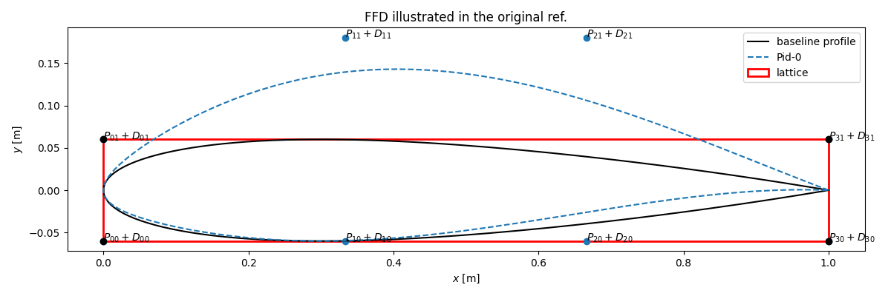
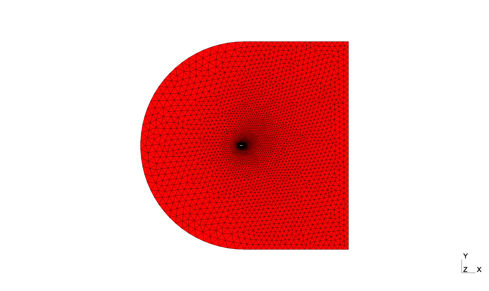
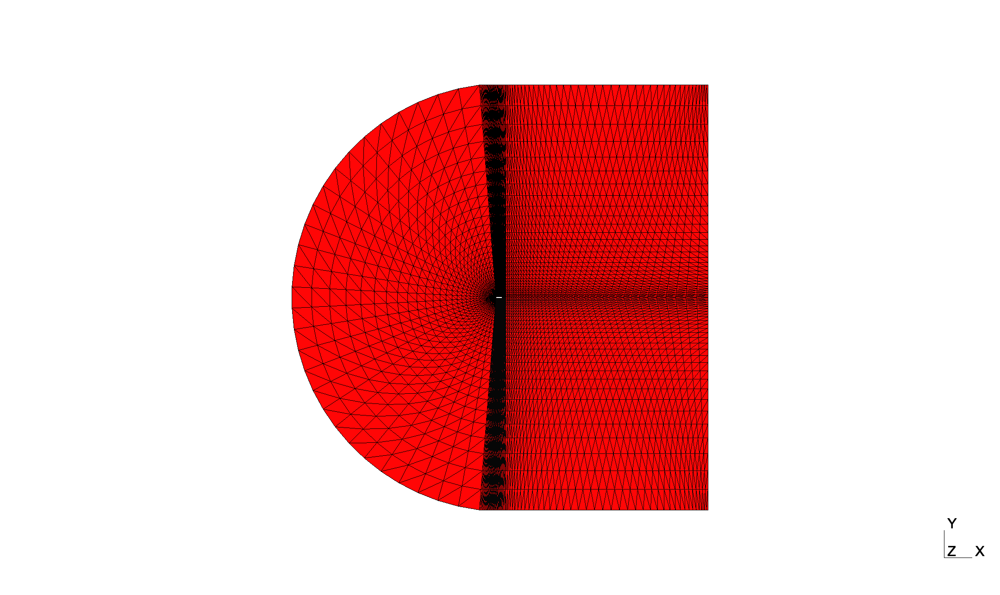

## Welcome to AERO-Optim
AERO-Optim is a simple aerodynamic shape optimization framework coupling FreeForm Deformation (FFD), automatic meshing with [`gmsh`](https://gmsh.info/doc/texinfo/gmsh.html) and any CFD solver execution in the frame of an optimization algorithm based on [`inspyred`](https://inspyred.readthedocs.io/en/latest/). It is composed of the following core components:

* [FFD](ffd.md): which defines a class to perform 2D FFD of a given geometry,
* [Mesh](mesh.md): which defines multiples classes to generate automatic meshes,
* [Simulator](simulator.md): which defines a class to orchestrate CFD simulations including pre- and post-processing steps as well as progress monitoring,
* [Optimizer](optimizer.md): which defines a class to coordinate the optimization procedure according to [`inspyred`](https://inspyred.readthedocs.io/en/latest/) conventions.

### Quick Installation
AERO-Optim comes with few dependencies listed in [`requirements.txt`](https://github.com/mschouler/aero-optim/blob/master/requirements.txt) and recalled below:
```sh
gmsh        # to design and visualize meshes (MESH)
inspyred    # optimzation toolbox (OPTIM)
numpy       # to manipulate geometries as arrays (FFD)
matplotlib  # to visualize the generated deformed profiles (FFD)
pandas      # to load simulation results (OPTIM)
scipy       # to use quasi monte carlo samplers (FFD)
```

From the user's working directory, they can all be installed at once in a [virtual environment](https://docs.python.org/3/library/venv.html) with the following commands:
```sh
git clone https://github.com/mschouler/aero-optim.git
cd aero-optim
python3 -m venv .venv
source .venv/bin/activate
pip install -r requirements.txt
```

!!! Warning
    So far, the framework was only installed and tested on MacOS and Linux platforms.

### First Execution
The framework was designed to automate aerodynamic optimization which, in this case, consists in:

1) deforming a baseline geometry,

2) generating its associated mesh,

3) performing a CFD computation,

as many times as required to obtain a geometry maximizing/minimizing certain quantities of interest (QoIs).

Although the chaining of these steps is performed under the supervision of [`main_optim.py`](https://github.com/mschouler/aero-optim/blob/add-docs/main_optim.py), the three subscripts presented below were introduced to facilitate each step's individual evaluation:

#### First FFD: [`auto_ffd.py`](https://github.com/mschouler/aero-optim/blob/master/auto_ffd.py)
This script performs one or multiple FFD of the geometry passed as its input argument. For instance:
```sh
python3 auto_ffd.py -f input/naca12.dat -nc 2 -d 0. 0. 1. 1.
```
will yield the figure below:
<p float="left">
  
</p>
where the deformation vector is $$[D_{10}, D_{20}, D_{11}, D_{21}] = [0., 0., 1., 1.]$$ in lattice unit (see [FFD](ffd.md)).

#### First Mesh: [`auto_gmsh.py`](https://github.com/mschouler/aero-optim/blob/master/auto_gmsh.py)
This script generates a simple mesh parameterized according to its associated configuration file. For instance:
```sh
python3 auto_gmsh.py --config=input/naca_base.json  # left figure
python3 auto_gmsh.py --config=input/naca_block.json # right figure
```
will generate the figures below:
<p float="left">
  
   
</p>

#### First Simulation: [`auto_simulator.py`](https://github.com/mschouler/aero-optim/blob/master/auto_simulator.py)
This script performs a single simulation according to its associated configuration file and mesh. For instance:
```sh
python3 auto_simulator.py -c input/naca_base.json -f output/naca_base.mesh
```
would run a [`Wolf`](https://pages.saclay.inria.fr/frederic.alauzet/software.html) simulation provided that the user has access to the solver and that they have properly specified the path to the executable:
```sh
INFO:src.simulator:simulation {'generation': 0, 'candidate': 0} finished
INFO:src.simulator:g0, c0 converged in 979 it.
INFO:src.simulator:last five values:
ResTot       CD       CL        ResCD        ResCL
2.312145e-07 0.211356 0.285446 3.077764e-10 1.245845e-09
2.262290e-07 0.211356 0.285446 2.979812e-10 1.260310e-09
2.213444e-07 0.211356 0.285446 2.884310e-10 1.273839e-09
2.165587e-07 0.211356 0.285446 2.791201e-10 1.286458e-09
2.118700e-07 0.211356 0.285446 2.700434e-10 1.298195e-09
>> simulation finished after 18.21726393699646 seconds
```

!!! Warning
    In order for the command to pass, don't forget to fix the `exec_cmd` executable path in `input/naca_base.json`.

!!! Note
    As of 2024, [`Wolf`](https://pages.saclay.inria.fr/frederic.alauzet/software.html) is not open-source and may not be available to the user. Guidelines on how to replace it with another solver are given in [Simulator](simulator.md).
