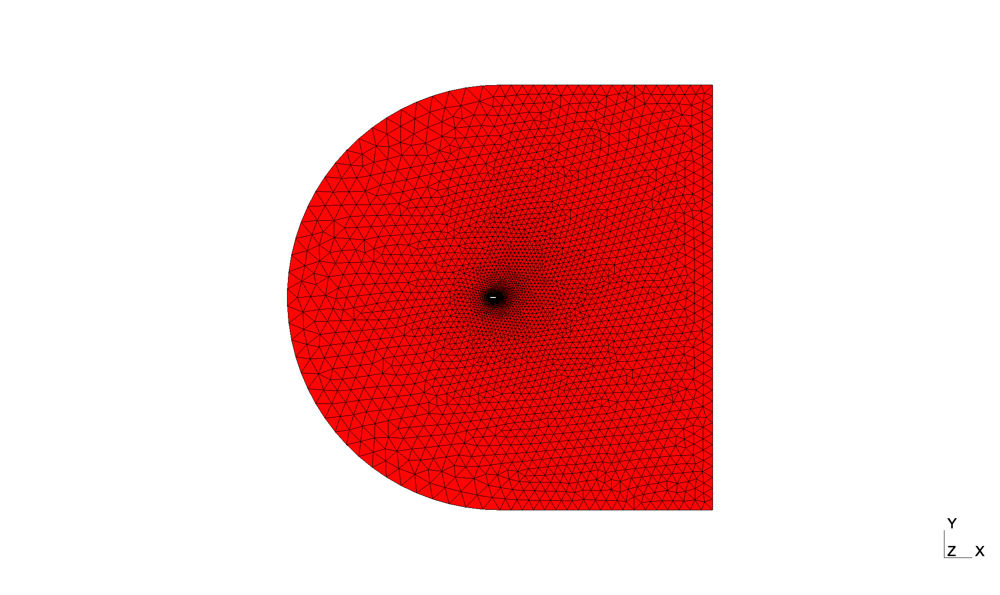
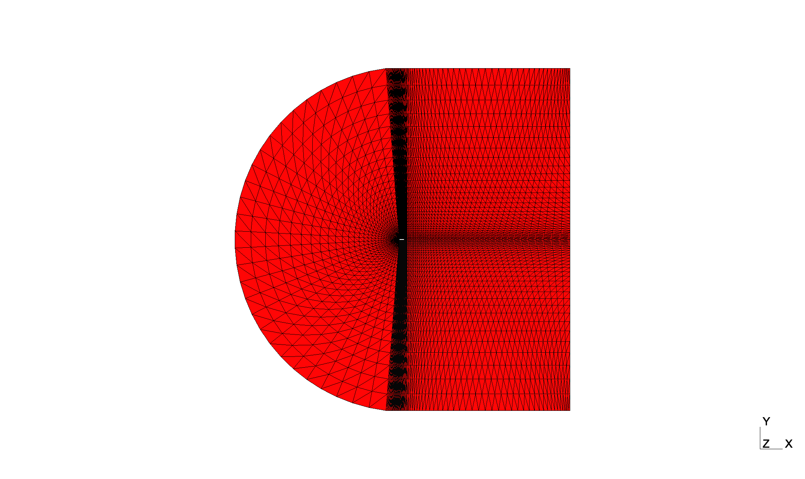
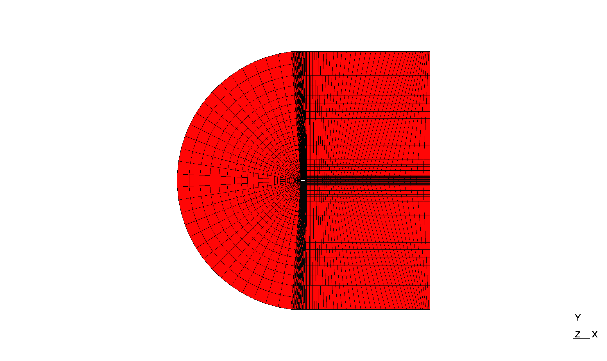
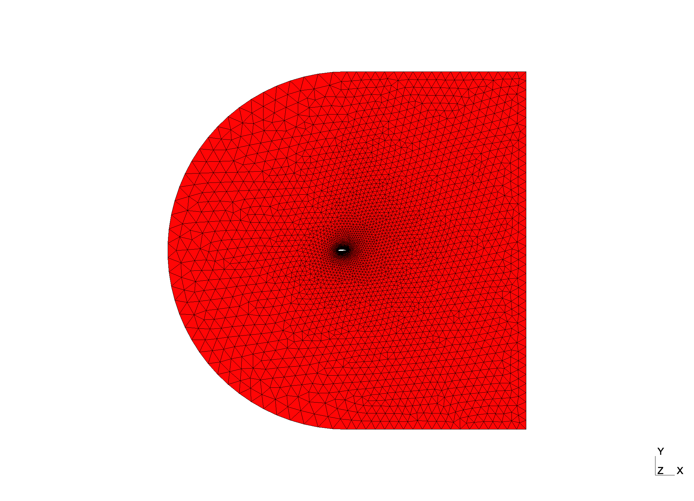

## Mesh Module
The meshing module builds on the [`gmsh` Python API](https://gmsh.info/doc/texinfo/gmsh.html). Modules inheriting from a basic [`Mesh`](https://github.com/mschouler/aero-optim/blob/master/src/mesh.py#L65-L169) class are implemented for NACA airfoil use-cases:

* [`NACABase`](https://github.com/mschouler/aero-optim/blob/master/src/naca_base_mesh.py#L9-L206): implements a simple meshing routine with minimal parameters,
* [`NACABlock`](https://github.com/mschouler/aero-optim/blob/master/src/naca_block_mesh.py#L9-L121):  implements a structured by blocks meshing routine.

Both cases are parameterized with a `json` formatted configuration file made of several dictionaries:
```json
{
  "study": {
        // study entries parameterizing the study and input/output options
    },
    "gmsh": {
        // mesh related entries parameterizing gmsh api
        "domain": {
            // domain entries parameterizing the computational domain size
        },
        "mesh": {
            // meshing entries parameterizing the boundary layer,
            // the domain boundaries and the extrusion if defined
        },
        "view": {
            // visualization entries parameterizing the GUI display
        }
    }
}
```

The meshing routine then goes through the following steps:

1. a `ChildMesh` object is instantiated from the configuration dictionary,
2. the `build_mesh()` method is called on the instantiated object which then triggers subsequent calls:
    * `build_2dmesh()` that builds the computational domain and defines 2D meshing parameters (e.g. number of nodes, growth ratio)
    * `split_naca()` that pre-processes the geometry coordinates list
3.  the mesh is finally generated, GUI options are set and outputs (e.g. meshing log, output mesh) are written.

!!! Note
    For both classes, all meshing parameters are discussed in their respective class definition.

### NACA Base
Meshing details relative to the basic routine reside in the [`build_2dmesh()`](https://github.com/mschouler/aero-optim/blob/master/src/naca_base_mesh.py#L143-L206) method and its inner calls. For instance, the [`split_naca()`](https://github.com/mschouler/aero-optim/blob/master/src/naca_base_mesh.py#L106-L126) method describes how the naca profile should be split into its upper and lower parts. This is critical to the domain construction steps in `build_2dmesh()` since the trailing and leading edges may be used as construction points. 

The `build_2dmesh()` routine of the `NACABaseMesh` class also gives the possibility to mesh the boundary layer by calling [`build_bl()`](https://github.com/mschouler/aero-optim/blob/master/src/naca_base_mesh.py#L128-L141). The meshing of the boundary layer is triggered by setting `"bl"`to `true` in the `"mesh"` category of the configuration file.

For this class, the computational domain is a rectangle whose inlet face (on the left) is made of a semi-circle. The domain dimensions are parameterized in the `"domain"` section of `naca_config.json`:
```json
"domain": {
    "inlet": 20,
    "outlet": 20,
    "le_offset": 10
}
```
where `"inlet"` and `"outlet"` respectively indicate the inlet face radius centered on the airfoil trailing edge and the outlet distance to the airfoil trailing edge. `"le_offset"` parameterizes the size (in point number) of the leading edge portion that is meshed with its own refinement level.

The `"mesh"` entry contains various meshing parameters such as the number of nodes on the domain inner and outer boundaries or the parameters of the boundary layer if needed:
```json
"mesh": {
    "nodes_inlet": 40,
    "nodes_outlet": 40,
    "side_nodes": 20,
    "le": 20,
    "low": 70,
    "up": 70
}
```
where the first three entries indicate the number of nodes on the outer boundaries. `"le"` is the number of nodes to mesh the leading edge portion defined earlier while the trailing upper and lower portions are respectively meshed with `"low"` and `"up"` nodes.

Finally, the `"view"` entry contains GUI options to turn it on or off, to display quality metrics and to split the view.

!!! Note
    In the context of an optimization loop, the GUI must be deactivated by setting `"GUI"` to `false` so that the mesh production can be chained.

### NACA Block
This meshing routine inherits from `NACABaseMesh` whose [`build_2dmesh()`](https://github.com/mschouler/aero-optim/blob/master/src/naca_block_mesh.py#L20-L121) method is overridden for this class. Hence, the boundary layer cannot be meshed with `build_bl()` which is not called anymore. In addition, the domain is this time made of several inner blocks.

Hence for this class, the computational domain still has the same general structure (a rectangle with a semi-circular inlet) but inner blocks are defined and parameterized in `"domain"`:
```json
"domain": {
    "inlet": 20,
    "outlet": 20,
    "le_offset": 10,
    "block_width": 2.5
}
```
where `"le_offset"` and `"block_width"` respectively parameterize the size (in point number) of the leading edge portion around which the circular revolves and the size of the trailing blocks that encompass the remaining of the airfoil.

The `"mesh"` entry contains various meshing parameters such as the number of nodes on the domain inner/outer boundaries and blocks:
```json
"mesh": {
    "structured": false,
    "n_inlet": 30,
    "n_vertical": 30,
    "r_vertical": 1.1,
    "n_airfoil": 30,
    "r_airfoil": 1,
    "n_wake": 40,
    "r_wake": 1.05
}
```
where the `"r_"` and `"n_"` prefixes respectively configure growth ratio and node numbers. 

### Illustration
Examples of unstructured meshes obtained with both routines are given below:
<p float="left">
  
   
</p>

### Quick Experiments
The `auto_gmsh.py` scripts enables basic testing and visualization for a given configuration file.

For instance setting `"structured"` to `true` in `naca_block_mesh.json` will produce a fully structured mesh:
```sh
python3 auto_gmsh.py --config=input/naca_block.json
```
<p float="left">
  
</p>

It is also possible to supersede the config `"file"` entry with the `--file` input argument. Hence, any previously generated deformed geometry can be meshed according to the naca routine with the commands below:
```sh
python3 auto_ffd.py -f input/naca12.dat -nc 2 -d 0. 0. 1. 1.
python3 auto_gmsh.py --config=input/naca_base.json --file=output/naca12_g0_c0.dat
```
<p float="left">
  
</p>