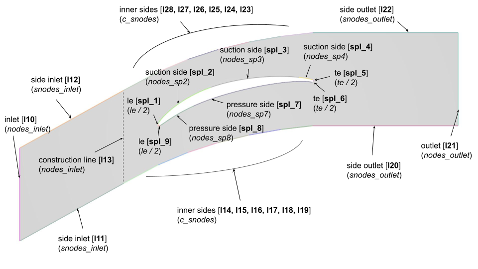
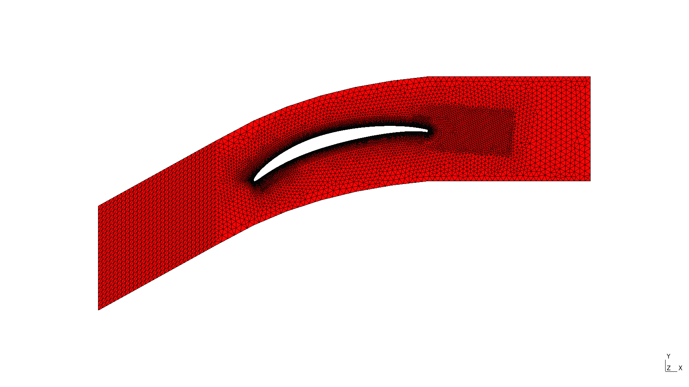
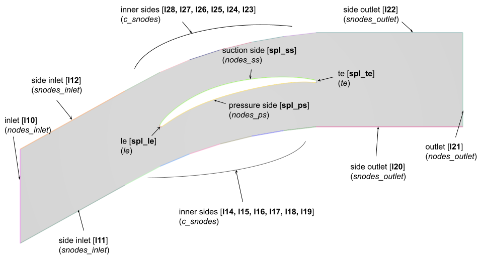
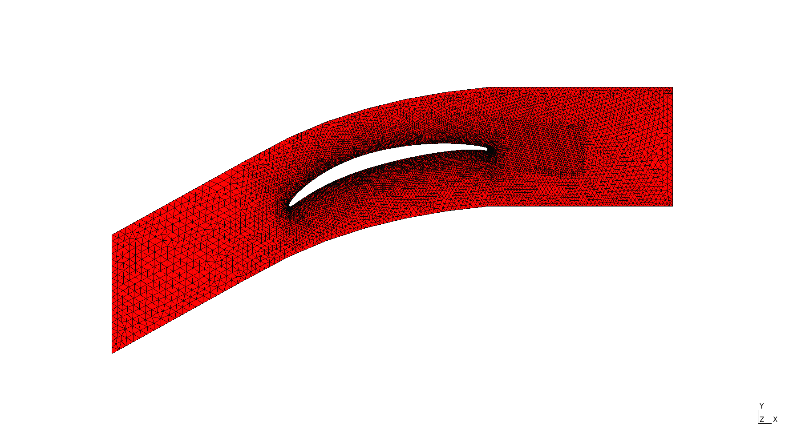

## Mesh Module
The meshing module builds on the [`gmsh` Python API](https://gmsh.info/doc/texinfo/gmsh.html). Classes inheriting from a basic `Mesh` class are implemented for NACA airfoil use-cases:

* `NACABaseMesh`: implements a simple meshing routine for a naca12 profile with minimal parameters,
* `NACABlockMesh`:  implements a structured by blocks meshing routine for a naca12 profile,
* `CascadeMesh`: implements an unstructured meshing routine for a compressor cascade with periodic elements.

All three meshes are parameterized with a `json` formatted configuration file made of several dictionaries:
```json
{
  "study": {
        // study entries parameterizing the study and input/output options
    },
    "gmsh": {
        // mesh related entries parameterizing gmsh api
        "domain": {
            // domain entries parameterizing the computational domain size
        },
        "mesh": {
            // meshing entries parameterizing the boundary layer,
            // the domain boundaries and the extrusion if defined
        },
        "view": {
            // visualization entries parameterizing the GUI display
        }
    }
}
```

The meshing routine then goes through the following steps:

1) a `Mesh` object is instantiated from the configuration dictionary,

2) the `build_mesh()` method is called on the instantiated object which then triggers subsequent calls:

  * `build_2dmesh()` that builds the computational domain and defines 2D meshing parameters (e.g. number of nodes, growth ratio)
  * `split_naca()` or `reorder_blade()` that pre-processes the geometry coordinates list

3)  the mesh is finally generated, GUI options are set and outputs (e.g. meshing log, output mesh) are written.

!!! Note
    All meshing parameters are described in their respective class definition (see [Developer Guide](dev_mesh.md)).

### NACA
For the NACA use-case, two meshing routines were implemented. The first one is a very basic mesh with a few parameters while the second one was adapted from a structured mesh generation procedure. Although they have similar domains, the meshing routines differ in many aspects which is why they were handled through separate modules, with separate configuration files and in their respective use-case folders (i.e. `NACA12/naca_base` and `NACA12/naca_block`).

#### NACA Base
Meshing details relative to this routine reside in the `build_2dmesh()` method and its inner calls. For instance, the `split_naca()` method describes how the naca profile should be split into its upper and lower parts. This is critical to the domain construction steps in `build_2dmesh()` since the trailing and leading edges may be used as construction points. 

The `build_2dmesh()` routine of the `NACABaseMesh` class also gives the possibility to mesh the boundary layer by calling `build_bl()`. The meshing of the boundary layer is triggered by setting `"bl"`to `true` in the `"mesh"` category of the configuration file.

For this class, the computational domain is a rectangle whose inlet face (on the left) is made of a semi-circle. The domain dimensions are parameterized in the `"domain"` section of the configuration file:

- `inlet (int)`: the inlet face radius centered on the airfoil trailing edge,
- `outlet (int)`: the outlet distance to the airfoil trailing,
- `le_offset (int)`: the size (in point number) of the leading edge portion that is meshed with its own refinement level.

The `"mesh"` entry contains various meshing parameters such as the number of nodes on the domain inner and outer boundaries or the parameters of the boundary layer if needed:

- `nodes_inlet (int)`: the number of nodes to mesh the inlet boundary,
- `nodes_outlet (int)`: the number of nodes to mesh the outlet boundary,
- `side_nodes (int)`: the number of nodes to mesh the upper and lower side boundaries,
- `le (int)`: the number of nodes to mesh the leading edge portion defined earlier,
- `low (int)`: the number of nodes to mesh the trailing lower portion of the airfoil,
- `up (int)`: the number of nodes to mesh the trailing upper portion of the airfoil.

For this meshing routine, other `"mesh"` parameters can be used to parameterize the meshing of the boundary layer (BL):

- `bl (bool)`: whether to mesh the boundary layer (True) or not (False).
- `bl_thickness (float)`: the BL meshing cumulated thickness.
- `bl_ratio (float)`: the BL meshing growth ratio.
- `bl_size (float)`: the BL first element size.

Finally, the `"view"` entry contains GUI options to turn it on or off, to display quality metrics and to split the view.

#### NACA Block
This meshing routine also inherits from `Mesh`. Particularities of this routine mostly lies in the `build_2dmesh()` method. Hence, the boundary layer cannot be meshed with `build_bl()` which is not called anymore. In addition, the domain is this time made of several inner blocks.

Hence for this class, the computational domain still has the same general structure (a rectangle with a semi-circular inlet) but inner blocks are defined and parameterized in `"domain"`:

- `inlet (int)`: the inlet face radius centered on the airfoil trailing edge,
- `outlet (int)`: the outlet distance to the airfoil trailing,
- `le_offset (int)`: the size (in point number) of the leading edge portion that is meshed with its own refinement level,
- `block_width (float)`: the size of the trailing blocks that encompass the remaining of the airfoil.

The `"mesh"` entry contains various meshing parameters such as the number of nodes on the domain inner/outer boundaries and blocks:

- `n_inlet (int)`: the number of nodes to mesh the inlet and the leading edge,
- `n_vertical (int)`: number of nodes to mesh the outlet and the blocks in the vertical direction,
- `r_vertical (int)`: the outlet and vertical direction growth ratio,
- `n_airfoil (int)`: the number of nodes to mesh both sides of the trailing portion of the airfoil,
- `r_airfoil (int)`: the airfoil sides growth ratio,
- `n_wake (int)`: the number of nodes in the wake direction,
- `r_wake (int)`: the wake growth ratio.

Examples of unstructured meshes obtained with the naca routines are given below:
<p float="left">
  
   
</p>

### Cascade
This meshing routine corresponds to an internal flow simulation which was initially proposed by the DLR as a structured mesh to be used for LES simulations. Since the mesh is not meant for RANS simulations nor for adaptation (it has a coarse surface and boundary layer mesh), the `DLR_mesh` option (which is `False` by default) enables to switch the meshing routine to a simpler routine generating a mesh usable as a starting point of an adaptation procedure.

#### DLR cascade mesh
Setting the configuration file `"mesh"` parameters as follows:
```json
"mesh": {
    "DLR_mesh": true,
    "bl": true,
    "bl_thickness": 4e-3,
    "bl_ratio": 1.15,
    "bl_size": 5e-5,
    "bl_sizefar": 5e-4,
    "nodes_inlet": 20,
    "nodes_outlet": 20,
    "side_nodes_inlet": 20,
    "side_nodes_outlet": 50,
    "curved_side_nodes": 10,
    "structured": false
}

```
will yield the DLR computational domain and mesh as illustrated in the figures below. The line/spline numbers are indicated between brackets and the corresponding meshing parameter between parenthesis.
<p float="left">
  
  
</p>

!!! Note
    This meshing routine was adapted from an existing gmsh file. For this reason, some parameters are hard coded inside the class definition (e.g. the points defining the blade splines and their progression values).

#### Simple cascade mesh
Setting the configuration file `"mesh"` parameters as follows:
```json
"mesh": {
    "bl": false,
    "nodes_inlet": 20,
    "nodes_outlet": 20,
    "side_nodes_inlet": 20,
    "side_nodes_outlet": 50,
    "curved_side_nodes": 10,
    "le": 16,
    "te": 16,
    "nodes_ss": 200,
    "nodes_ps": 200,
    "structured": false
}
```
will yield the computational domain and mesh as illustrated in the figures below. Again, the line/spline numbers are indicated between brackets and the corresponding meshing parameter between parenthesis.
<p float="left">
  
  
</p>

!!! Warning
    - For the second routine, the number of splines making up the blade wall is different from the number of splines in the DLR version.
    - For both routines, if the mesh is saved as a medit file (i.e. `.mesh` format), the tags of the upper and lower boundaries will automatically be merged so that there eventually only remains one tag per periodic size (28 for the superior boundary and 11 for the inferior one).

    **Do not forget to adapt the solver input file in consequence when defining the boundary conditions!**

### Quick Experiments
The `auto_gmsh.py` scripts is called with the `mesh` command. It enables basic testing and visualization for a given configuration file:
```sh
mesh --help
usage: mesh [-h] [-c CONFIG] [-f FILE] [-o OUTDIR]

options:
  -h, --help            show this help message and exit
  -c CONFIG, --config CONFIG
                        config: --config=/path/to/config.json (default: None)
  -f FILE, --file FILE  input dat file: --file=/path/to/file.dat (default: )
  -o OUTDIR, --outdir OUTDIR
                        simulation output directory (default: )
```

For instance setting `"structured"` to `true` in `naca_block_mesh.json` will produce a fully structured mesh:
```sh
# from aero-optim to naca_block
cd examples/NACA12/naca_block
mesh --config=naca_block.json
```
<p float="left">
  
</p>

It is also possible to supersede the config `"file"` entry with the `--file` input argument. Hence, any previously generated deformed geometry can be meshed according to the naca routine with the commands below:
```sh
# from naca_block to naca_base
cd ../naca_base
ffd -f ../data/naca12.dat -nc 2 -d "0. 0. 1. 1."
mesh --config=naca_base.json --file=output/naca12_g0_c0.dat
```
<p float="left">
  
</p>
