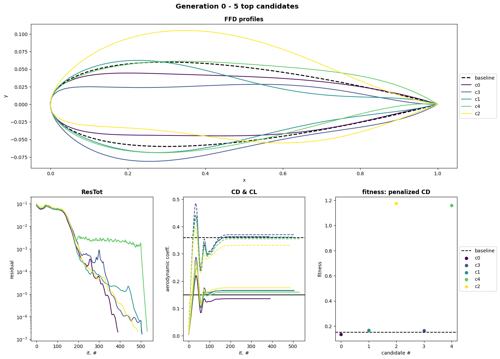

## Optimizer Module
The optimizer module is designed to define all components required by an evolution algorithm based on [`inspyred`](https://inspyred.readthedocs.io/en/latest/):

- `generator`: a function used to sample an initial population,
- `observer`: a function executed after each evaluation,
- `evaluator`: a function used to extract the quantities of interest (QoIs) of all population candidates,
- some additional optimization arguments.

For each of them, an `Optimizer` attributes or methods are passed to the [`ec.evolve`](https://inspyred.readthedocs.io/en/latest/reference.html#ec-evolutionary-computation-framework) function.

### Optimizer
The `Optimizer` abstract class extracts general arguments from the `"optim"` and `"study"` dictionaries of the configuration file such as:

- `[optim] n_design (int)`: the number of design points i.e. the dimension of the problem,
- `[optim] doe_size (int)`: the doe/population size i.e. the number of individuals per generation,
- `[optim] max_generations (int)`: the maximal number of generations to evaluate,
- `[study] file (str)`: the baseline geometry file,
- `[study] outdir (str)`: the optimization output directory,
- `[study] study_type (str)`: the type of study i.e. the meshing routine to use.

It instantiates optimization related objects:

- `generator (Generator)`: object to sample the initial DOE,
- `ffd (FFD_2D)`: object to deform the baseline geometry,
- `gmsh_mesh (Mesh)`: object to mesh the deformed geometry. 

It also implements the following three base methods:

- `process_config`: which goes through the configuration file making sure expected entries are well defined,
- `deform`: which generates the deformed candidate,
- `mesh`: which meshes the deformed candidates.

The `Optimizer` class acts as an `evaluator` and implements the `evaluate` method.

!!! Tip
    The `Generator` class is based on [`scipy.qmc`](https://docs.scipy.org/doc/scipy/reference/stats.qmc.html) samplers. It supports three different sampling techniques: ["lhs"](https://docs.scipy.org/doc/scipy/reference/generated/scipy.stats.qmc.LatinHypercube.html#scipy.stats.qmc.LatinHypercube), ["halton"](https://docs.scipy.org/doc/scipy/reference/generated/scipy.stats.qmc.Halton.html#scipy.stats.qmc.Halton) and ["sobol"](https://docs.scipy.org/doc/scipy/reference/generated/scipy.stats.qmc.Sobol.html#scipy.stats.qmc.Sobol). The sampling technique is selected with the `sampler_name` entry of the `"optim"` dictionary in the configuration file.

!!! Note
    All optimizer parameters are described in their respective class definition (see [`Optimizer`](dev_optimizer.md#src.ins_optimizer.Optimizer), [`WolfOptimizer`](dev_optimizer.md#src.ins_optimizer.WolfOptimizer)).

### Wolf Optimizer
The `WolfOptimizer` class illustrates how `Optimizer` can be inherited to perform a `Wolf`-based optimization.

It first instantiates a `WolfSimulator` attribute that is then used in the `evaluate` method where for all candidates, the following steps are performed:

1) geometry deformation,

2) deformed geometry meshing,

3) simulation execution,

4) post-processing i.e. QoI extraction and constraint application.

!!! Note
    The `constraint` method based on [`inspyred` documentation](https://inspyred.readthedocs.io/en/latest/recipes.html#constraint-selection) is put in place in order to penalize inadequate geometries both in terms of area and lift coefficient.

In the end, all simulations QoIs are returned as a list of floats. In addition, after each evaluation the `observe` method is called to write or display the results of each generation candidates.

### Quick Experiments
The `main_optim.py` script enables to launch full optimization loops in accordance with the configuration file specifications.

For instance, `naca_base.json` executes a single iteration of the [Evolution Strategy](https://pythonhosted.org/inspyred/examples.html#evolution-strategy) algorithm with 20 candidates and 8 variables of design sampled between -1 and 1 (in lattice units):
```py
python3 main_optim.py -c input/naca_base.json
```
<p float="left">
  
</p>

!!! Tip
    In the configuration file, the `budget` entry should be adapted to the amount of resources available to the user.
