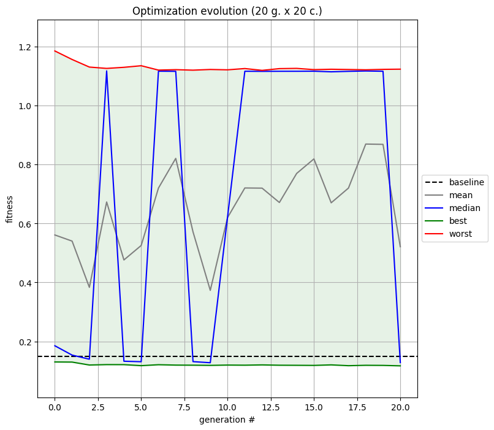
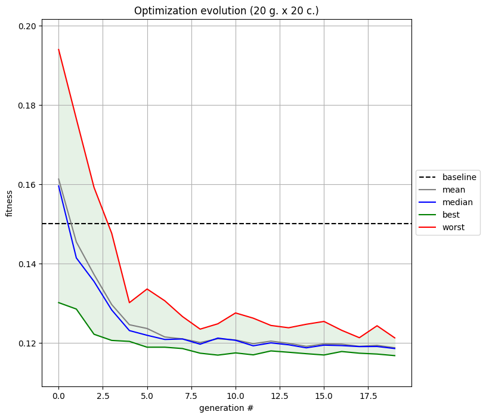

## Optimizer Module
The optimizer module is designed to define all components required by an evolution algorithm based on the [`inspyred`](https://inspyred.readthedocs.io/en/latest/) logic:

- `generator`: a function used to sample an initial population,
- `observer`: a function executed after each evaluation,
- `evaluator`: a function used to evaluate the candidates of each generation,
- some additional optimization arguments.

The framework currently supports two optimization libraries : [`inspyred`](https://pythonhosted.org/inspyred/index.html) and [`pymoo`](https://pymoo.org/index.html).
Thus, `Optimizer` attributes and methods are passed to the evolutionary computation algorithm (see [`ec`](https://pythonhosted.org/inspyred/reference.html#ec-evolutionary-computation-framework) framework for `inspyred` and [algorithms](https://pymoo.org/algorithms/list.html) in `pymoo`) and its optimization method (see [`ec.evolve`](https://pythonhosted.org/inspyred/reference.html?highlight=evolve#inspyred.ec.EvolutionaryComputation.evolve) for `inspyred` and [`optimize.minimize`](https://pymoo.org/interface/minimize.html?highlight=minimize) for `pymoo`). To do so, the `Evolution` class ensures that the algorithm object and the optimization method are set and executed according to the chosen library requirements. 

### Optimizer
The `Optimizer` abstract class extracts general arguments from the `"optim"` and `"study"` dictionaries of the configuration file such as:

- `[optim] n_design (int)`: the number of design points i.e. the dimension of the problem,
- `[optim] doe_size (int)`: the doe/population size i.e. the number of individuals per generation,
- `[optim] max_generations (int)`: the maximal number of generations to evaluate,
- `[study] file (str)`: the baseline geometry file,
- `[study] outdir (str)`: the optimization output directory,
- `[study] study_type (str)`: the type of study i.e. the meshing routine to use.

It instantiates optimization related objects:

- `generator (Generator)`: object to sample the initial DOE,
- `ffd (FFD_2D)`: object to deform the baseline geometry,
- `gmsh_mesh (Mesh)`: object to mesh the deformed geometry. 

It also implements the following three base methods:

- `process_config`: which goes through the configuration file making sure expected entries are well defined,
- `deform`: which generates the deformed candidate,
- `mesh`: which meshes the deformed candidates.

Regardless of the optimization library, the `Optimizer` class acts as an `evaluator` and must hence implement an `_evaluate` method that is used during the optimization. However since they both have their own specificities in terms of candidate management, typing and structure, the choice has been made to inherit the `Optimizer` class separately for each library.

!!! Tip
    The `Generator` class is based on [`scipy.qmc`](https://docs.scipy.org/doc/scipy/reference/stats.qmc.html) samplers. It supports three different sampling techniques: ["lhs"](https://docs.scipy.org/doc/scipy/reference/generated/scipy.stats.qmc.LatinHypercube.html#scipy.stats.qmc.LatinHypercube), ["halton"](https://docs.scipy.org/doc/scipy/reference/generated/scipy.stats.qmc.Halton.html#scipy.stats.qmc.Halton) and ["sobol"](https://docs.scipy.org/doc/scipy/reference/generated/scipy.stats.qmc.Sobol.html#scipy.stats.qmc.Sobol). The sampling technique is selected with the `sampler_name` entry of the `"optim"` dictionary in the configuration file.

!!! Note
    All optimizer parameters are described in their respective class definition (see [`Optimizer`](dev_optimizer.md#aero_optim.optimizer.Optimizer), [`WolfOptimizer (inspyred)`](dev_optimizer.md#aero_optim.inspyred_optimizer.WolfOptimizer), [`WolfOptimizer (pymoo)`](dev_optimizer.md#aero_optim.pymoo_optimizer.WolfOptimizer)).

### Wolf Optimizer
The `WolfOptimizer` class illustrates how `Optimizer` can be inherited to perform a `Wolf`-based optimization. **It is the default optimizer used when running `optim`**.

Regardless of the optimization library, it first instantiates a `WolfSimulator` attribute that is then used in the `_evaluate` method where for all candidates, the following steps are performed:

1) geometry deformation,

2) deformed geometry meshing,

3) simulation execution,

4) post-processing i.e. QoI extraction and constraint application.

!!! Note
    Design constraints penalizing inadequate geometries both in terms of area and lift coefficient are managed with `apply_constraints` for `inspyred` (see [here](https://inspyred.readthedocs.io/en/latest/recipes.html#constraint-selection)) and for `pymoo` (see [here](https://pymoo.org/constraints/index.html)).

In the end, all simulations QoIs are returned either as a list of floats (with `inspyred`) or as a `numpy` array (with `pymoo`). In addition, after each evaluation the `_observe` method is called (automatically with `inspyred`, explicitly with `pymoo`) to write or display the results of each generation candidates.

The overall optimization progress is illustrated as the evolution of the generations statistics plotted and saved with the `final_observe` method.

### Debug Optimizer
The `DebugOptimizer` class was introduced to facilitate prototyping and debugging. It is based on the `DebugSimulator` and follows a simplified structure of a classic optimizer without constraints, no geometry deformation nor meshing but where candidates are simply evaluation of the [Ackley function](https://pymoo.org/problems/single/ackley.html?highlight=ackley). **This optimizer is used when running `optim` with the `--debug` option**.

In addition, the `_observe` method does not generate  any figure but only updates the optimization statistics which are finally plotted and saved with `final_observe`. 

!!! Note
    For this class, candidates are not evaluated concurrently in distinct subprocesses but sequentially inside the `_evaluate` method.

### Quick Experiments
The `main_optim.py` scripts is called with the `optim` command. It enable to launch a full optimization in accordance with the configuration file specifications:
```sh
usage: optim [-h] [-c CONFIG] [-p] [-i] [-f CUSTOM_FILE] [-d] [-v VERBOSE]

options:
  -h, --help            show this help message and exit
  -c CONFIG, --config CONFIG
                        /path/to/config.json (default: None)
  -p, --pymoo           use the pymoo library (default: False)
  -i, --inspyred        use the inspyred library (default: False)
  -f CUSTOM_FILE, --custom-file CUSTOM_FILE
                        /path/to/custom_file.py (default: )
  -d, --debug           use DEBUG mode (default: False)
  -v VERBOSE, --verbose VERBOSE
                        logger verbosity level (default: 3)
```

For instance, setting `doe_size` and `max_generations` to 20 in `naca_base.json` and running the command below:
```sh
# from aero-optim to naca_base
cd examples/NACA12/naca_base
optim -c naca_base.json --inspyred
```
will perfom a 20 generations x 20 candidates optimization with `inspyred` and yield the following figure:
<p float="left">
  
</p>

Using the `--pymoo` option instead will yield the following graph:
<p float="left">
  
</p>

The main difference between these two results stems from the fact that, as opposed to `pymoo` which does not explicitly modify the fitness value of a penalized candidate, the `inspyred` optimizer does. Hence, any penalized candidate gets its fitness increased by one. Although this does not affect the optimization behavior, it does change the generations statistics.

!!! Note
    By default, the area penalization sanctions any candidate whose area is greater/smaller than the baseline area +/- 40%. This constraint can be altered for instance by setting `area_margin` to any other percentage value in the `"optim"` sub-dictionary of the configuration file.

!!! Tip
    In the configuration file, the `budget` entry should be adapted to the amount of resources available to the user.
