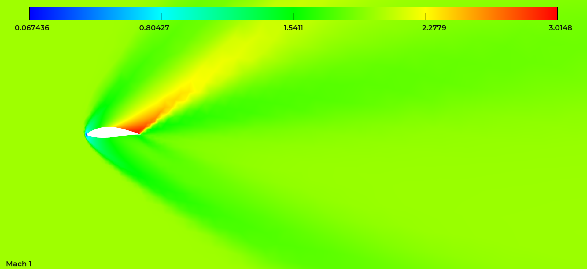

## Simulator Module
The simulator module is designed to orchestrate one or several simulation executions with a given solver.
Hence, an `Simulator` abstract class extracts general arguments from the `"simulator"` dictionary of the configuration file such as:

- `exec_cmd (str)`: the solver execution command that is to be launched in the terminal,
- `ref_input (str)`: the path to the solver input template,
- `sim_args (dict)`: simulation arguments with which to customize the template,
- `post_process (dict)`: post-processing arguments to indicate which variables to extract from which result files.

Then, any subclass inheriting from `Simulator` can be built by overriding two abstract methods:

1. `process_config`: which goes through the configuration file making sure expected entries are well defined,
2. `execute_sim`: which defines how a simulation should be executed.

!!! Note
    All simulator parameters are described in their respective class definition (see [`Simulator`](dev_simulator.md#src.simulator.Simulator), [`WolfSimulator`](dev_simulator.md#src.simulator.WolfSimulator)).

### Wolf Simulator
The `WolfSimulator` class illustrates how `Simulator` can be inherited to perform `Wolf` simulations. In addition to the mandatory methods, several others are introduced in order to facilitate the simulation progress monitoring (see `sim_pro` and `monitor_sim_progress`) and the results post-processing (see `post_process`).

Finally, a mechanism of fault management is introduced with a `kill_all` method. The idea here is simply to provide a function to kill all active simulations in case something goes wrong in the main program. In the context of an optimization for instance, this feature is particularly important if the user wants to interrupt the main program without having to kill all simulations by hand.

### Debug Simulator
The `DebugSimulator` class was introduced to facilitate prototyping and debugging. Instead of a real simulation execution, it directly evaluates the [Ackley function](https://pymoo.org/problems/single/ackley.html?highlight=ackley) for a given candidate.

### Quick Experiment
The `auto_simulator.py` scripts is called with the `simulator` command. It enables basic testing and execution for a given configuration file:
```sh
simulator --help
usage: simulator [-h] [-c CONFIG] [-f FILE] [-o OUTDIR]

options:
  -h, --help            show this help message and exit
  -c CONFIG, --config CONFIG
                        config: --config=/path/to/config.json (default: None)
  -f FILE, --file FILE  input mesh file: --file=/path/to/file.mesh (default: )
  -o OUTDIR, --outdir OUTDIR
                        simulation output directory (default: )
```

For instance the commands below will generate a deformed profile, its associated mesh and perform a simulation with it:
```sh
# from aero-optim to naca_base
cd examples/NACA12/naca_base
ffd -f ../data/naca12.dat -nc 2 -d "0. 0. 1. 1."
mesh --config=naca_base.json --file=output/naca12_g0_c0.dat
simulator --config=naca_base.json --file=output/naca_base.mesh
```

A zoomed view of the solution mach field plotted with [`vizir4`](https://pyamg.saclay.inria.fr/vizir4.html) is illustrated below:
<p float="left">
  
</p>

### Advanced Simulator
Considering the variety of solvers, execution environment, etc., the `Simulator` class is theoretically adaptable to any use case. In general, it is good practice to keep track of any [Python subprocess](https://docs.python.org/3/library/subprocess.html) spawned by the application. However, depending on the user's situation, more sophisticated monitoring routines may need to be implemented.

For a cluster using a [slurm batch scheduler](https://slurm.schedmd.com/documentation.html) for instance, there are multiple ways to submit simulations whether they are submitted interactively (e.g. with `srun`) or not (e.g. with `sbatch`). In the latter case, progress monitoring cannot be made through simple subprocess tracking but by interacting with the batch scheduler database (e.g. with `sacct`). Illustrative code on how to do so is available in the [melissa repository](https://gitlab.inria.fr/melissa/melissa) (see [scheduler](https://gitlab.inria.fr/melissa/melissa/-/tree/develop/melissa/scheduler)).
